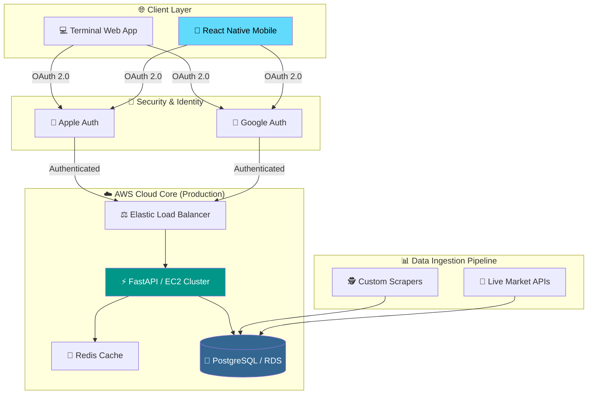

---

# 🌌 QUANTUM ANALİZ — Enterprise Financial Intelligence & Ecosystem

---

## 🏗️ ENTERPRISE SYSTEM ARCHITECTURE

Platformun mimarisi, verinin Bursa'dan (yerel kaynaklar) başlayıp AWS global sunucularına uzanan yolculuğunu ve kullanıcıya ulaşan son katmanı kapsar:



---

## 🚀 TECHNOLOGICAL DEEP DIVE

### 🐘 1. ANALYTICAL DATABASE LAYER (POSTGRESQL)

Proje, finansal verilerin karmaşıklığını yönetmek için **Amazon RDS (PostgreSQL)** üzerine kurgulanmıştır.

* **Time-Series Data:** Hisse senedi fiyat hareketleri, yüksek hacimli zaman serisi verileri olarak PostgreSQL üzerinde optimize edilmiş indekslerle saklanır.
* **Relational Integrity:** Kullanıcı portföyleri, takip listeleri ve finansal rasyolar arasındaki ilişkiler, **3. Normal Form (3NF)** prensiplerine sadık kalarak modellendi.
* **Performance:** Karmaşık finansal sorgular için `Stored Procedures` ve `Views` katmanları kullanılarak API üzerindeki yük minimize edildi.

### 🔐 2. IDENTITY MANAGEMENT (SSO INTEGRATION)

Kurumsal güvenlik standartlarını karşılamak için **Single Sign-On (SSO)** yapısı entegre edildi:

* **Apple Auth:** iOS kullanıcıları için biyometrik güvenlikle entegre, sıfır-bilgi (zero-knowledge) gizlilik odaklı giriş katmanı.
* **Google Auth:** Geniş kullanıcı kitlesi için standartlaştırılmış, güvenli OAuth 2.0 kimlik doğrulama akışı.
* **JWT Security:** Başarılı giriş sonrası sistem, tüm API isteklerini doğrulamak için şifrelenmiş **JSON Web Token** (JWT) üretir.

### ☁️ 3. AWS "FULL-STACK" INFRASTRUCTURE

Sistem, AWS üzerinde tamamen izole edilmiş bir **VPC (Virtual Private Cloud)** içerisinde yaşar:

* **High Availability:** Sunucular farklı `Availability Zone`'larda yedekli çalışır.
* **S3 Data Lake:** Ham borsa dataları ve loglar, ileriye dönük model eğitimi için S3 üzerinde arşivlenir.
* **CloudWatch:** Sistemin sağlığı, API gecikmeleri ve veritabanı sorgu süreleri 7/24 izlenir.

### 📱 4. MULTI-PLATFORM FRONTEND (WEB & MOBILE)

* **React Native:** Tek kod tabanıyla hem iOS hem Android üzerinde çalışan, finansal grafiklerin 60 FPS akıcılıkla render edildiği mobil uygulama.
* **Web Terminal:** Profesyonel yatırımcılar için geliştirilmiş, büyük ekranlarda detaylı teknik analiz yapılmasına olanak sağlayan web arayüzü.

---

## 📂 REPOSITORY & DEPLOYMENT LOGIC

Bu repo, sistemin **Showcase** (vitrin) sürümüdür. Algoritmik sırlar ve ticari mantık özel repolarda saklanır:

```text
.
├── aws-infra/          # CloudFormation / Terraform (Infrastructure as Code)
├── backend-fastapi/    # RESTful API logic & PostgreSQL migrations
├── mobile-app/         # React Native (iOS & Android) source
├── web-dashboard/      # Terminal web interface
├── security/           # OAuth2, Apple & Google Auth handlers
└── README.md           # Engineering blueprint

```

---

## 👨‍💻 DEVELOPER & SYSTEM ARCHITECT

**Ferhat Koç**

*Data Engineer & Quant Developer*

GitHub: [ferhattkoc-ml]()

Web: [quantumanaliz.com]()

---

