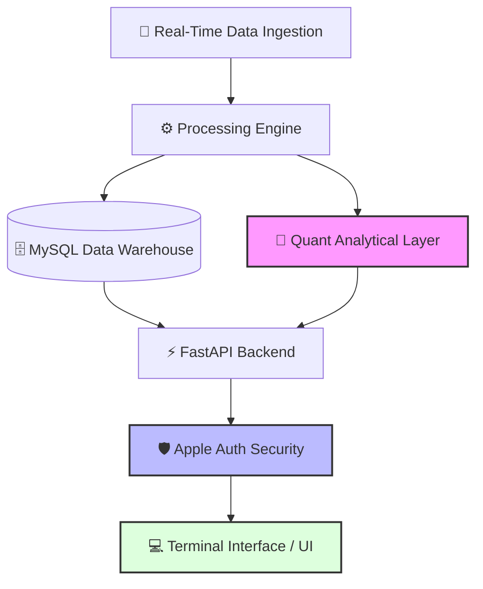

---

# 🌌 QUANTUM ANALİZ — High-Frequency Equity Intelligence Terminal

---

## 🏛️ SYSTEM ARCHITECTURE & DATA PIPELINE

Quantum Analiz is built on a decoupled architecture optimized for low-latency data processing and high-availability inference.



---

## 🚀 CORE CAPABILITIES

### 📈 MULTI-DIMENSIONAL EQUITY ANALYSIS

The terminal processes thousands of data points to deliver:

* **Technical Indicator Suites:** Real-time RSI, MACD, and Bollinger Band calculations.
* **Fundamental Health Scoring:** Automated balance sheet and income statement auditing.
* **Volatility Tracking:** Historical and implied volatility mapping for risk management.

### 🛡️ ENTERPRISE-GRADE SECURITY (APPLE AUTH)

Integrating **Sign in with Apple** was a strategic engineering choice to ensure:

* Zero-knowledge user authentication.
* Seamless cross-device experience (Web to Mobile).
* High-level data privacy for proprietary portfolio tracking.

### ⚡ HIGH-PERFORMANCE DATA INGESTION

* Custom-built scrapers and API connectors for Borsa Istanbul and global markets.
* Optimized SQL schemas for time-series financial data storage and retrieval.

---

## 📂 REPOSITORY LOGIC (SHOWCASE ONLY)

**NOTICE:** This repository serves as a **Technical Showcase**. To protect the proprietary financial algorithms and "Quantum" logic, the core calculation engine is kept private.

This dökümantasyon outlines the infrastructure, system design, and product vision:

```text
.
├── architecture/       # Detailed system design diagrams
├── assets/             # Terminal UI screenshots and performance metrics
├── docs/               # Research paper & Logic outlines
├── schemas/            # Database normalization patterns (3NF)
└── README.md           # Project overview & Technical specs

```

---

## ⚙️ ENGINEERING PRINCIPLES

1. **DATA INTEGRITY:** Multi-stage validation for incoming financial feeds to prevent outlier-driven false signals.
2. **LATENCY OPTIMIZATION:** Asynchronous API calls and indexed database queries for sub-second terminal updates.
3. **SCALABILITY:** Containerized services ready for AWS/Cloud deployment to handle increasing concurrent user loads.

---

## 🧪 THE "QUANTUM" APPROACH

Unlike standard charting tools, **Quantum Analiz** treats the market as a high-dimensional signal processing problem. By focusing on **Volume-Price Analysis** and **Trend Exhaustion** metrics, the platform provides a systematic edge in identifying market reversals.

---

## 👨‍💻 DEVELOPER & VISIONARY

**Ferhat Koç**

*Data Engineer & Quant Analytics Developer*

[quantumanaliz.com]() | [GitHub]()

---

